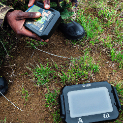
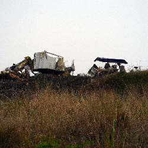
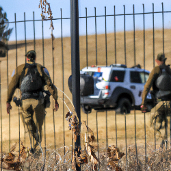
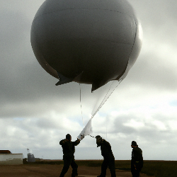
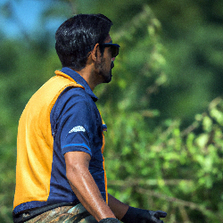
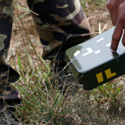
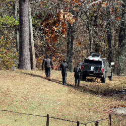
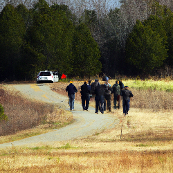
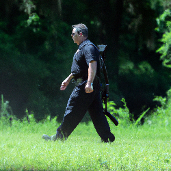
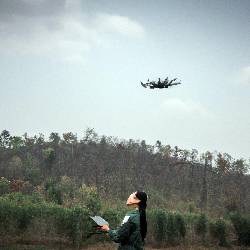

<!-- ```
      _________    _________    ____  ___                __                 ___           ___
     /  ______/\  /  ____  /\  /   /\/  /\              /_/\               /  /\         /  /\ 
    /  /\_____\/ /  /___/ / / /   / /  / /              \_\/              /  / /     ___/  /_/
   /  / /       /  ______/ / /    \/  / /  _____      ___    ______      /  /_/___  /__   ___/\
  /  / /       /  /\_____\/ /  _     / /  /     \    /  /\  /  __  \    /  ___   /\ \_/  /\__\/
 /  /_/____   /  / /       /  /\\    \/  /  /\  /\  /  / / /  /_/  /|  /  /\ /  / /  /  / /  __    __    __
/_________/\ /__/ /       /__/ / \___/\ /__/ /_/ / /__/ / /_____  / / /__/ //__/ /  /__/ /  /_/\  /_/\  /_/\
\_________\/ \__\/        \__\/   \__\/ \__\/\_\/  \__\/  \____/ / /  \__\/ \__\/   \__\/   \_\/  \_\/  \_\/
                                                           ___/ / /
                                                          /____/ /
                                                          \____\/
``` -->                         

### :wrench: WHAT I MAKE &ndash; 

I design and build low-cost autonomous sensor payload packages that attach to aerial drones, as well as related accessories. 

<!-- I design and build specialty **personal autonomous reconnaissance devices** &ndash; these are embedded systems that are often described as &ldquo;*Edge AI*&rdquo; devices, but are also designed for completely-disconnected, autonomous operations. My designs incorporate both off-the-shelf and custom hardware, computer vision, machine learning, and artificial intelligence components to enable autonomous intelligence, surveillance, and reconnaissance (ISR) activities in remote and harsh environments, including from aerial vehicles. -->

<!-- 
|  |  |  |  | 
| :-----------------: | :-----------------: | :-----------------: | :-----------------: | 
|  |  |  |  | 
|  |  |  |  | -->

### :technologist: MY TECH &ndash;

<!-- 


The devices that I make involve three main things &ndash; :one: **reconnaissance algorithms**, :two: **autonomous devices**, and :three: their **means of conveyance**.

1. At the core of my devices are **reconnaissance algorithms**. These take inputs from various sensors to make observations of the outside world (such as "_I observe an airplane_" or "_that airplane is moving toward 51.112,-112.324 at 105 knots_") and then draw specific inferences and conclusions (such as "_from observations, I am confident that I am located at 51.112,-112.324_" or "_descend and move to the right immediately to avoid a collision_"). I create, adapt, and improve various different types of algorithms for these purposes, with much of my recent work focusing on **convolutional neural networks** that process vertical **aerial imagery**. However, algorithms can be simple or complex in and of themselves - it is the way in which these algorithms are layered together that yield accurate and useful insights about the world. I generally implement these algorithms as firmware to be embedded in low-cost hardware devices.

2. The **autonomous devices** that I build are hardware and firmware assemblies designed to autonomously make observations about their surroundings and then communicate those observations back to their (human) owner in a timely and convenient manner. Autonomous devices are independent and self-suficient, and can be placed anywhere that their owners see fit - once a device is configured for its particular reconnaissance "_mission_", it continues to make and communicate its observations until its owner tells it otherwise. My focus is on building low-cost, lightweight devices that can be used in a variety of environments (including, or perhaps _especially_, harsh environments) in order to augument the abilities of their owners. These are cheap enough to be expendible, but durable and flexible enough to be used for a long time in a variety of different situations.

3. My autonomous devices are pretty useful observers, but they can't move around the world on their own - they need a **means of conveyance** if they are to get around. For this reason, I make protective enclosures and adapters that allow the devices to be worn or carried by their owners, protected in remote locations, or affixed to a vehicle or robot (such as light aircraft, aerostats, parachutes, or drones). Depending on the application, these enclosures and adapters can provide extra power for the devices (such as with solar panels), extra protection in certain environments, or integrate directly with their vehicle or robot to help with things like navigation or communication. 

-->

### :card_file_box: MY PROJECTS &ndash;

A summary of the projects that I've worked on in the past, or am working on at the moment, for the design, development, and manufacture of these devices:

| Project | Summary | Status | 
| :------ | :------ | :----: |
| `Ain` | :three: Prototype data-capture devices from freefall parachutes. | `Superceded` |
| `Alpes` | :three: Prototype conveyance structure for freefall devices. | `Superceded` |
| `Aube` | :three: Protype guided freefall device conveyance. | `Superceded` |
| `Aveyron` | :three: Reference aerial conveyance platforms &ndash; flying wing and quadcopter. | `Active` |
| `Beaufort` | :three: Parachute design, development, and manufacture. | `Active` |
| `Cantal` | :three: Protective enclosure and fixed mounting system for air and ground deployments. | `Active` |
| `Garonne` | :one: Algorthims, software, firmware and hardware architectures for autonomous devices. | `Active` |
| `Sarthe` | :one: Convolutional neural networks for vertical and high oblique imagery. | `Active` |
| `Vosges` | :two: Personal autonomous reconnaissance observer device design and manufacturing. | `Active` |
| `Yonne` | :two: Portable autonomous GNSS clock. | `Active` |

### :information_source: FOR MORE INFORMATION &ndash;

While many of the devices I build are *ad hoc* designs for custom applications (please [contact me](mailto:chris@cpknight.io) to discuss your specific requirements), I have my range of “[Paro](https://github.com/cpknight/Paro)” (*Personal Autonomous Reconnaissance Observer*) devices available off-the-shelf through speciality distributors. <!-- in the United States, the United Kingdom, France, Australia, and Israel. -->

For more information about what **Edge AI** is, I recommend the following books and articles:

- [Jon Y/Asianometry](https://substack.com/profile/113937-jon-y) :page_facing_up: **[The Hard Problems of Edge AI Hardware](https://www.asianometry.com/p/the-hard-problems-of-edge-ai-hardware)**
- [Jon Y/Asianometry](https://substack.com/profile/113937-jon-y) :tv: **[The Hard Tradeoffs of Edge AI Hardware](https://www.youtube.com/watch?v=DAPgDuw1uZM)**
- [Daniel Situnayake](https://github.com/dansitu) &amp; [Jenny Plunkett](https://github.com/jennyplunkett): :closed_book: **[AI at the Edge](https://learning.oreilly.com/library/view/ai-at-the/9781098120191/)**  
- [Ellen Glover/Built In](https://builtin.com/authors/ellen-glover): :page_facing_up: **[What is Edge AI?](https://builtin.com/artificial-intelligence/edge-ai)**
- [Tiffany Yeung/NVIDA](https://blogs.nvidia.com/blog/author/tiffanyyeung/): :page_facing_up: **[What Is Edge AI and How Does It Work?](https://blogs.nvidia.com/blog/what-is-edge-ai/)**
- [IBM](https://www.ibm.com/): :page_facing_up: **[What is edge AI?](https://www.ibm.com/topics/edge-ai)**
- [Wikipedia](https://wikipedia.org): :bookmark_tabs: **[Artificial Intelligence](https://en.wikipedia.org/wiki/Artificial_intelligence)**
- [Wikipedia](https://wikipedia.org): :bookmark_tabs: **[Edge Computing](https://en.wikipedia.org/wiki/Edge_computing)**
