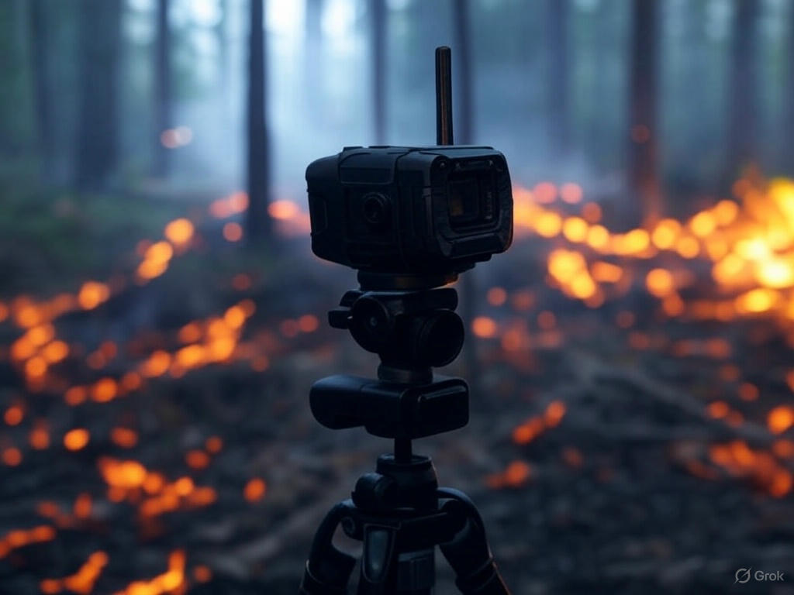
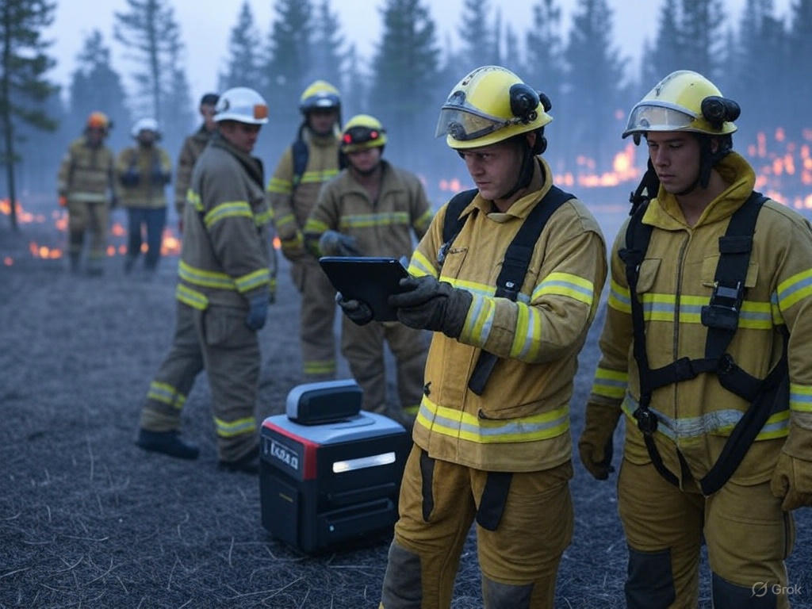

<!-- ```
      _________    _________    ____  ___                __                 ___           ___
     /  ______/\  /  ____  /\  /   /\/  /\              /_/\               /  /\         /  /\ 
    /  /\_____\/ /  /___/ / / /   / /  / /              \_\/              /  / /     ___/  /_/
   /  / /       /  ______/ / /    \/  / /  _____      ___    ______      /  /_/___  /__   ___/\
  /  / /       /  /\_____\/ /  _     / /  /     \    /  /\  /  __  \    /  ___   /\ \_/  /\__\/
 /  /_/____   /  / /       /  /\\    \/  /  /\  /\  /  / / /  /_/  /|  /  /\ /  / /  /  / /  __    __    __
/_________/\ /__/ /       /__/ / \___/\ /__/ /_/ / /__/ / /_____  / / /__/ //__/ /  /__/ /  /_/\  /_/\  /_/\
\_________\/ \__\/        \__\/   \__\/ \__\/\_\/  \__\/  \____/ / /  \__\/ \__\/   \__\/   \_\/  \_\/  \_\/
                                                           ___/ / /
                                                          /____/ /
                                                          \____\/
``` -->                         


I design and build software, firmware, and hardware. My focus is on creating autonomous systems that strengthen human decision-making by streamlining the [intelligence cycle](https://www.cia.gov/legacy/intelligence-cycle/) and other decision-making frameworks such as [OODA loops](https://fs.blog/ooda-loop/) or [PDCA cycles](https://asq.org/quality-resources/pdca-cycle). My autonomous support systems cover _direction_ (setting clear objectives), _collection_ (gathering relevant data and collating results), _processing_ (analyzing and interpreting information), and _dissemination_ (producing and sharing actionable insights and generating feedback). My work ensures humans stay central, guiding tech to amplify their choices.

I have two broad efforts in this respect: (1) [**Paro**](https://github.com/cpknight/Paro) devices handle missions for data collection and real-time analysis, assigned through the direction process. They’re built to be durable yet affordable, deployable at scale in tough environments. (2) The cloud-based platform at [**recce.services**](https://reconnaissance.services) integrates the full cycle—defining objectives, collecting data, analyzing it, and sharing results—with direction as the critical starting point to align every step.

My [projects and repositories](https://github.com/cpknight/projects) explore embedded systems, neural networks for image and vision processing, and modular software that fits into broader workflows. I’m inspired by applications where timely insights save lives, like forest firefighting, search-and-rescue, or public safety. Dive into the repos for device code and AI-driven analysis, or visit the links above to learn more.

|  |  |
| :-----------------: | :-----------------: | 
