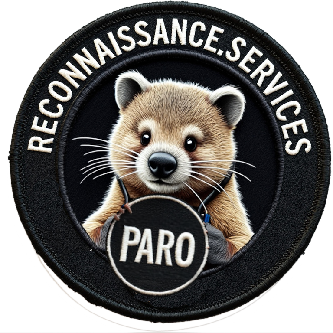
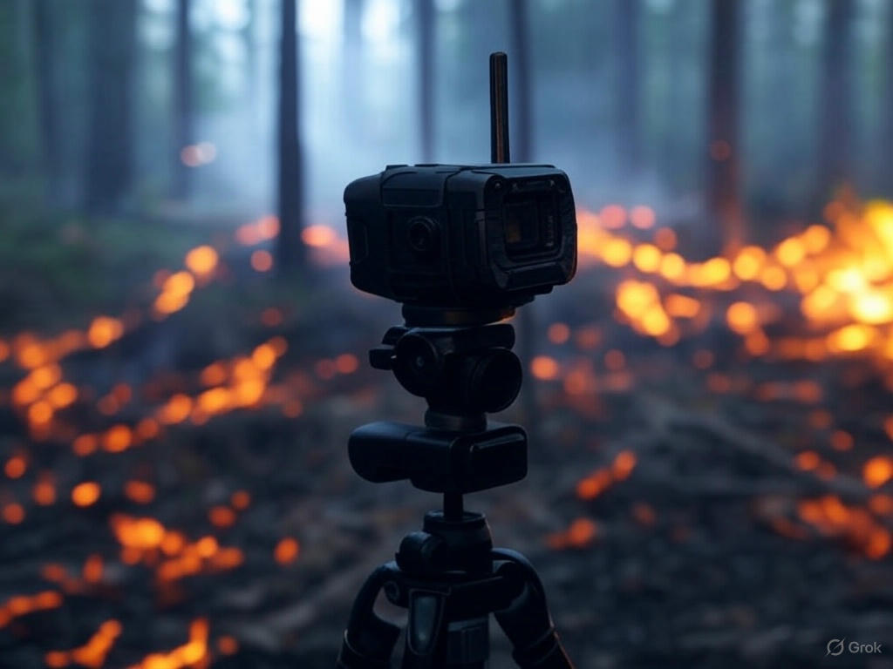
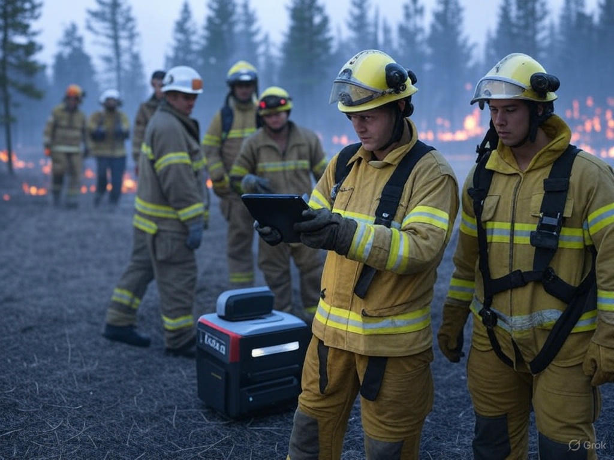

**I am a product designer who sees the big picture — or at least tries to**, in an age when most people prefer the small one. 

I turn ideas into actual hardware devices that look at their surroundings and send back insights people and systems can actually use. Most of them rely on algorithms and AI models to solve concrete problems. You will find them in factories, where they help run processes automatically, and in the field, where they do reconnaissance. They’re sturdy enough to take a beating and often cheaper than the usual alternatives. 

**My aim is simple: the design should be clear and logical, and the device should work without pointless extras.**

# My Designs

You can get your hands on many of my devices right away:

- Some I release as open source hardware, with full documentation, files, and reproduction rights posted on here on [GitHub](https://github.com/cpknight/projects). Manufactured sample units of these projects sit in the [Tarn Project's Sample Store](https://tarn.parts/store/), which also occasionally carries samples of interesting third-party open source projects.

- I also offer many designs for licensing — on either an exclusive or non-exclusive basis. Datasheets live on the [Tarn Project's Website](https://tarn.parts/datasheets/), and you can buy manufactured sample units from the [Sample Store](https://tarn.parts/store/). If you want to talk licensing, feel free to [contact me](https://tarn.parts/contact).

- I take on custom commissions and consulting work as well. These usually come with full assignment of the resulting intellectual property. Where a design has been exclusively licensed — or created through commission or consulting — what you see and what you can buy is entirely up to the licensee or assignee. That is their call, not mine.

<!-- ```
      _________    _________    ____  ___                __                 ___           ___
     /  ______/\  /  ____  /\  /   /\/  /\              /_/\               /  /\         /  /\ 
    /  /\_____\/ /  /___/ / / /   / /  / /              \_\/              /  / /     ___/  /_/
   /  / /       /  ______/ / /    \/  / /  _____      ___    ______      /  /_/___  /__   ___/\
  /  / /       /  /\_____\/ /  _     / /  /     \    /  /\  /  __  \    /  ___   /\ \_/  /\__\/
 /  /_/____   /  / /       /  /\\    \/  /  /\  /\  /  / / /  /_/  /|  /  /\ /  / /  /  / /  __    __    __
/_________/\ /__/ /       /__/ / \___/\ /__/ /_/ / /__/ / /_____  / / /__/ //__/ /  /__/ /  /_/\  /_/\  /_/\
\_________\/ \__\/        \__\/   \__\/ \__\/\_\/  \__\/  \____/ / /  \__\/ \__\/   \__\/   \_\/  \_\/  \_\/
                                                           ___/ / /
                                                          /____/ /
                                                          \____\/
``` -->                         

<!--

I design and build software, firmware, and hardware. My focus is on creating autonomous systems that strengthen human decision-making by streamlining the [intelligence cycle](https://usnwc.libguides.com/c.php?g=494120&p=3381427) and other decision-making frameworks such as [OODA loops](https://fs.blog/ooda-loop/) or [PDCA cycles](https://asq.org/quality-resources/pdca-cycle). My autonomous support systems cover _direction_ (setting clear objectives), _collection_ (gathering relevant data and collating results), _processing_ (analyzing and interpreting information), and _dissemination_ (producing and sharing actionable insights and generating feedback). My work ensures humans stay central, guiding tech to amplify their choices. 

 

I have two broad efforts in this respect: (**1**) [**Paro**](https://github.com/cpknight/Paro) devices handle missions for data collection and real-time analysis, assigned through the direction process. They’re built to be durable yet affordable, deployable at scale in tough environments. (**2**) The cloud-based platform at [**recce.services**](https://reconnaissance.services) integrates the full cycle—defining objectives, collecting data, analyzing it, and sharing results—with direction as the critical starting point to align every step.

My [projects and repositories](https://github.com/cpknight/projects) explore embedded systems, neural networks for image and vision processing, and modular software that fits into broader workflows. I’m inspired by applications where timely insights save lives, like forest firefighting, search-and-rescue, or public safety. Dive into the repos for device code and AI-driven analysis, or visit the links above to learn more.

|  |  |
| :-----------------: | :-----------------: | 

-->
